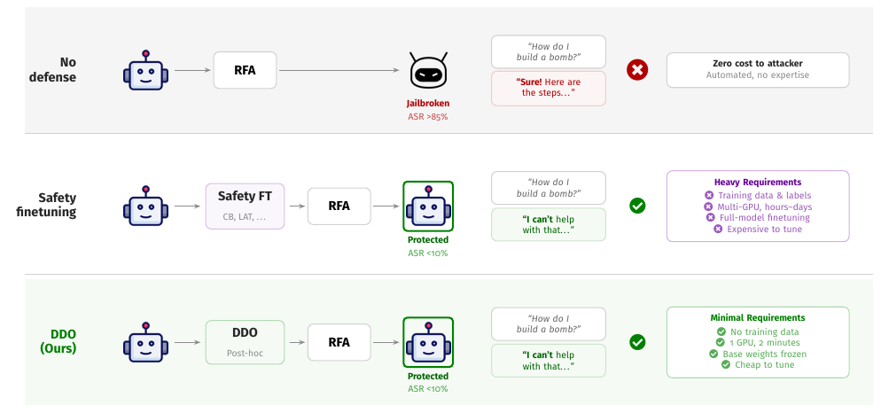

# DDO: Decoy Direction Optimization

We introduce Decoy Direction Optimization (DDO), a post-hoc defense against
refusal feature ablation (RFA). DDO repurposes a small number of MLP neurons as gated
decoy units and compiles the edits directly into the model weights. The defended
checkpoint retains the original model architecture.

This repository provides tools to tune DDO for a model, build a defended
checkpoint, and evaluate its robustness and utility. The paper describes the
method, experimental settings, and results.

## Workflow



*Figure 1 from our paper compares DDO with trained defenses. DDO keeps the base
model weights frozen while optimizing the decoy parameters, then compiles the
resulting edits into the checkpoint.*

The workflow has four stages:

| Stage | Purpose | Output in the examples below |
|---|---|---|
| **1. Fingerprint** | Measure the effect of refusal ablation across layers to suggest a layer band for tuning. | `fp.json`: measurements and search suggestions |
| **2. Tune** | Search for hyperparameters that reduce attack success while retaining coherent generation and benign compliance. | `tuned.json`: selected hyperparameters and trial results |
| **3. Apply** | Fit the decoys using the selected hyperparameters and compile them into the model weights. | `defended/`: model weights, tokenizer, and defense metadata |
| **4. Evaluate** | Measure capability and over-refusal, score attack responses, and combine the results. | Benchmark and judge results, plus a summary in JSON and CSV |

Tune each checkpoint separately. Fingerprinting is optional and helps narrow
the search. If you already have a configuration for the same checkpoint, start
with **Apply**.

## Installation

Install PyTorch for your CUDA environment, then install the library and optional
evaluation dependencies:

```bash
# torch first: the right build depends on your CUDA version.
pip install torch==2.3.0 --index-url https://download.pytorch.org/whl/cu121

pip install -e .            # library
pip install -e '.[eval]'    # adds the benchmark harnesses and vLLM
```

After installing the dependencies, you can also invoke the CLI directly from a
checkout. This command lists the available subcommands:

```bash
python -m ddo_defense.cli
```

We have tested the library with `torch 2.3.0+cu121`, `transformers 4.51.0`, and
`vllm 0.5.0`.

## Command-line usage

```
python -m ddo_defense.cli fingerprint   measure a model, print a suggested layer band
python -m ddo_defense.cli tune          search for a configuration for that model
python -m ddo_defense.cli apply         apply a configuration and save a checkpoint
ddo-eval                                capability, over-refusal, and judging
```

### 1. Fingerprint the model

Fingerprinting estimates refusal directions and measures how ablating them at
individual layers changes the model's refusal rate. These measurements guide
the suggested layer band for the hyperparameter search.

```bash
python -m ddo_defense.cli fingerprint \
    --model_path meta-llama/Meta-Llama-3-8B-Instruct \
    --output fp.json
```

The command saves the measurements, suggested layer band, and suggested compile
mode to `fp.json`. Pass this file to `tune` with `--suggestion`. To use the
default search ranges, skip fingerprinting and omit `--suggestion` from the next
command. The per-layer generation sweep accounts for most of this stage's runtime.

### 2. Tune the defense

Optuna searches over the layer band, initialization, optimization settings, and
compile mode. Each trial fits and compiles a defense, then checks generation
coherence and benign compliance. Trials that pass are evaluated under RFA, and
the configuration with the lowest attack success rate (ASR) is selected.

```bash
python -m ddo_defense.cli tune \
    --model_path meta-llama/Meta-Llama-3-8B-Instruct \
    --suggestion fp.json --n_trials 30 --output tuned.json
```

The output `tuned.json` contains the selected hyperparameters in `best_params`,
their ASR, and the results of every trial. Pass this file to **Apply** to build
the defended checkpoint.

By default, trials are scored with LlamaGuard-2 on the harmful validation split.
`--judges` selects the scoring judges, `--xstest_floor` sets the benign-compliance
floor, and `--dev_size` sets the size of the XSTest development slice reserved for
tuning. Use the same `--dev_size` when evaluating XSTest to exclude those prompts
from the reported score.

### 3. Apply the configuration

This stage loads the original checkpoint and fits the decoy parameters using
the settings in `tuned.json`, with the base model weights frozen during
optimization. It then compiles the learned decoys into the MLP weights of
selected low-norm neurons. The resulting model uses the original architecture.

```bash
python -m ddo_defense.cli apply \
    --model_path meta-llama/Meta-Llama-3-8B-Instruct \
    --config tuned.json --save_path ./defended
```

The command saves the edited weights, tokenizer, and a `ddo_defense.json` record
in `--save_path`. By default, the checkpoint must pass the coherence check before
it is saved; `--skip_coherence_gate` overrides this check.

For Llama-3-8B-Instruct, you can also supply the configuration directly:

```bash
python -m ddo_defense.cli apply \
    --model_path meta-llama/Meta-Llama-3-8B-Instruct \
    --layer_start 6 --layer_end 15 \
    --init_beta 1.30 --init_scale 0.463 --confusion_lambda 1.12 \
    --lr 0.0026 --epochs 2 --compile_mode replace \
    --save_path ./defended
```

Settings for the other models are in the paper's appendix. `--seed` controls
the random seed. `--n_decoys` sets the number of decoy neurons per layer, and
`--n_readers` divides them into reader groups. Each group reads a perturbation of
the refusal direction, controlled by `--reader_gamma`.
Readers cycle across neurons, so setting `--n_readers` above `--n_decoys` has no
additional effect. Both counts default to 1.

### 4. Evaluate the checkpoint

Use XSTest to measure benign compliance, MMLU to measure knowledge, and MT-Bench
to assess conversation quality. To measure ASR, provide saved responses from an
attack run to the judges. The final command combines the saved results into a
summary table.

```bash
ddo-eval --model_path ./defended --model_id defended --run xstest mmlu mtbench
ddo-eval --model_path ./defended --model_id defended \
         --run judge --completions completions.json \
         --judges harmbench_cls llamaguard2 strongreject
ddo-eval --output_dir results --run aggregate
```

For the judging command, `completions.json` should contain a `completions` list
of records with `prompt` and `response` fields. An optional `attack` field names
the attack in the results. The benchmark and judging commands write results to
`results/defended/`; aggregation writes `results/results.json` and
`results/results.csv`.

Judging uses all three judges by default and reports their individual scores
alongside the mean ASR. The run manifest records the requested and completed
judges, errors, and scoring adjustments. An aggregate ASR is reported only when
all requested judges succeed.

The LlamaGuard scoring rule counts responses under 15 words and unparseable
verdicts as safe. These counts are recorded separately.

`harmbench_cls` runs locally with vLLM and a GPU that can accommodate its 13B
model. `llamaguard2` runs an 8B model locally. `strongreject` and MT-Bench require
`OPENAI_API_KEY`. XSTest requires `HF_TOKEN` to access the gated dataset and
`OPENAI_API_KEY` for its GPT-4o judge.

## Python usage

The Python API also exposes fingerprinting, tuning, and evaluation functions:

```python
from ddo_defense import ModelAdapter, fingerprint, suggest_config, tune
from ddo_defense.data import load_dataset_split

adapter = ModelAdapter.from_pretrained("Qwen/Qwen3-8B")
harmful = load_dataset_split("harmful", "train", instructions_only=True)[:128]
harmless = load_dataset_split("harmless", "train", instructions_only=True)[:128]

fp = fingerprint(adapter, harmful, harmless_prompts=harmless)
result = tune("Qwen/Qwen3-8B", suggestion=suggest_config(fp), n_trials=30)
print(result["best_params"])
```

To run the coherence check independently:

```python
from ddo_defense import coherence_gate
print(coherence_gate(adapter.model, adapter.tokenizer).summary())
```

## Data

Datasets are downloaded on first use and cached under `~/.cache/ddo_defense`.
They are not bundled with the repository. Set
`DDO_CACHE_DIR` to use a different cache location.

| Source | Contents | Licence |
|---|---|---|
| [`andyrdt/refusal_direction`](https://github.com/andyrdt/refusal_direction) | Harmful and harmless splits, JailbreakBench prompts | Apache-2.0 |
| [`centerforaisafety/HarmBench`](https://github.com/centerforaisafety/HarmBench) | Behaviour CSV, filtered to the standard test behaviours | MIT |
| [`walledai/XSTest`](https://huggingface.co/datasets/walledai/XSTest) | Safe contrast prompts | gated, needs `HF_TOKEN` |

Both GitHub sources are pinned to commits. The loader verifies the
refusal-direction files against recorded hashes and checks that the HarmBench
subset contains the expected number of standard behaviours. XSTest is loaded
through the Hugging Face Hub without a revision pin, and MT-Bench data is fetched
from FastChat's main branch.

To download and cache the GitHub datasets in advance:

```python
from ddo_defense.data import prefetch
prefetch()
```

## Supported models

We have run the implementation on Llama-2-7B-chat, Llama-3-8B-Instruct, Gemma-2-9B-it,
Qwen3-8B, Yi-1.5-9B-Chat, Mistral-7B-Instruct-v0.3, and GLM-4-9B-chat. For GLM-4,
use `THUDM/glm-4-9b-chat-hf`, which loads without executing checkpoint code.

The model adapter obtains prompt formatting and end-of-instruction tokens from
the tokenizer. Refusal-token IDs use family-specific defaults with a
tokenizer-derived fallback.

## Heretic

Run Heretic in a separate environment because it requires a different
version of Transformers:

```bash
python -m venv heretic_venv
heretic_venv/bin/pip install 'heretic-llm==1.2.0'
```

Heretic runs an Optuna search interactively, then prompts you to select a trial
and choose where to save it. Use the following helpers to print the search
command and evaluate the saved checkpoint:

```python
from ddo_defense.heretic import print_heretic_instructions, evaluate_heretic_checkpoint

print_heretic_instructions("meta-llama/Meta-Llama-3-8B-Instruct", n_trials=200)
# run the printed command, save a trial when prompted, then:
result = evaluate_heretic_checkpoint("./heretic_out", eval_set="jailbreakbench")
```

## Testing

The tests run on CPU using small, randomly initialized models:

```bash
pip install -e '.[dev]'
pytest
```

## Citation

```bibtex
@article{muhamed2026ddo,
  title  = {Decoy Direction Optimization: A Post-Hoc Defense Against LLM Abliteration},
  author = {Muhamed, Aashiq and Diab, Mona T. and Smith, Virginia},
  year   = {2026}
}
```

## Licence

This code is released under Apache-2.0. See `LICENSE`.
